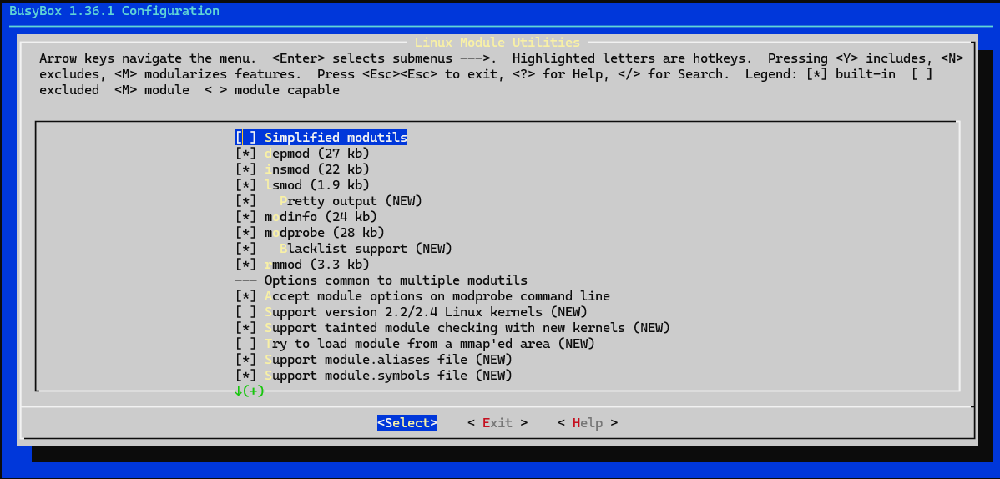
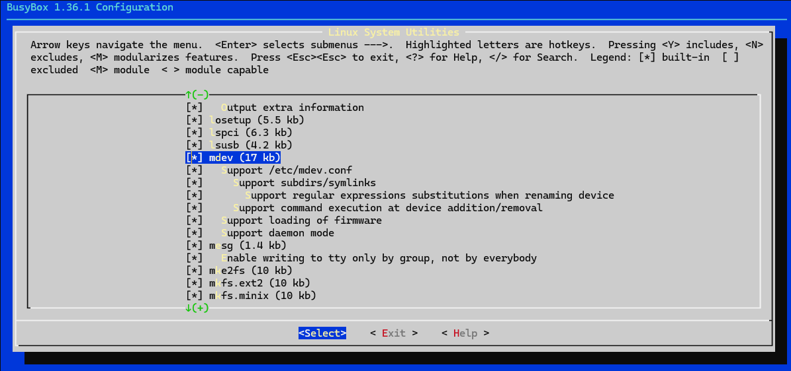
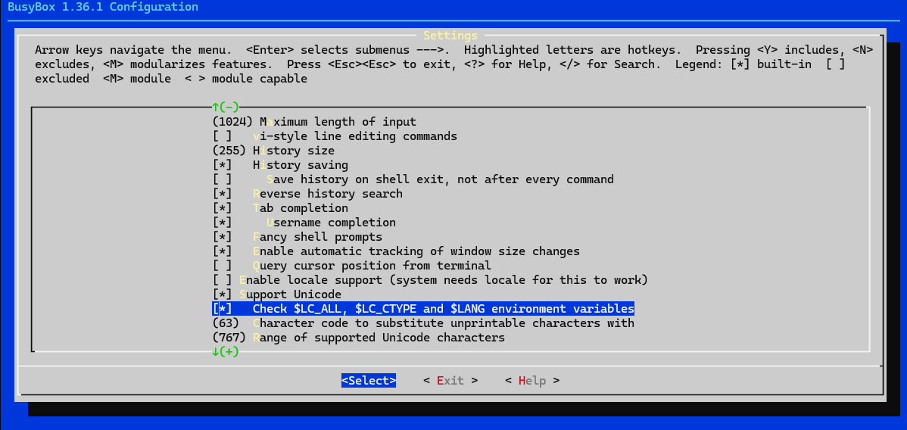

# 从源码构建树莓派系统镜像
一个完整的Linux系统由内核，文件系统和应用程序组成，本文使用OpenEuler内核和BusyBox工具箱为例，构建了一个Linux-5.10内核的，具有ext4根文件系统和常用命令应用程序的armv7l架构的32位简易操作系统
如果需要其他版本的内核，可以参考本文，然后自行替换即可。
构建环境为Ubuntu20.04-x86_64

目标机为树莓派4B

- [从源码构建树莓派系统镜像](#从源码构建树莓派系统镜像)
	- [交叉编译内核](#交叉编译内核)
		- [安装依赖](#安装依赖)
		- [下载内核源码](#下载内核源码)
		- [设置环境变量](#设置环境变量)
		- [设置内核参数](#设置内核参数)
			- [默认设置](#默认设置)
			- [手动设置](#手动设置)
		- [编译内核，模块，设备树文件](#编译内核模块设备树文件)
		- [收集编译结果](#收集编译结果)
			- [内核模块](#内核模块)
			- [内核](#内核)
			- [设备树文件和overlay文件](#设备树文件和overlay文件)
			- [把编译结果移动到上一级目录下](#把编译结果移动到上一级目录下)
	- [测试新编译的内核](#测试新编译的内核)
		- [将内核模块放到根分区里](#将内核模块放到根分区里)
		- [将内核放到boot启动分区](#将内核放到boot启动分区)
		- [将设备树文件放到boot启动分区](#将设备树文件放到boot启动分区)
		- [设置config.txt](#设置configtxt)
		- [卸载分区](#卸载分区)
		- [启动树莓派](#启动树莓派)
	- [构建rootfs](#构建rootfs)
		- [下载busybox工具](#下载busybox工具)
		- [设置支持中文](#设置支持中文)
		- [配置编译选项](#配置编译选项)
		- [编译busybox中的工具](#编译busybox中的工具)
	- [完善rootfs](#完善rootfs)
		- [添加动态链接库](#添加动态链接库)
		- [创建其他的所需文件夹](#创建其他的所需文件夹)
	- [构建引导](#构建引导)
		- [下载引导](#下载引导)
		- [替换文件](#替换文件)
		- [将boot移动出来](#将boot移动出来)
		- [添加配置文件](#添加配置文件)
	- [构建镜像](#构建镜像)
		- [计算镜像大小](#计算镜像大小)
		- [创建空镜像](#创建空镜像)
		- [镜像分区](#镜像分区)
		- [将磁盘镜像文件虚拟成块设备](#将磁盘镜像文件虚拟成块设备)
		- [创建分区表设备映射](#创建分区表设备映射)
		- [格式化分区](#格式化分区)
		- [挂载根目录分区和boot分区](#挂载根目录分区和boot分区)
		- [修改fstab使系统能正确挂载分区](#修改fstab使系统能正确挂载分区)
			- [获取blkid](#获取blkid)
			- [修改fstab](#修改fstab)
		- [将rootfs和boot复制到镜像](#将rootfs和boot复制到镜像)
		- [卸载镜像](#卸载镜像)
  
## 交叉编译内核
内核是操作系统的核心，负责和硬件直接交互，管理计算机运行所用的资源。
### 安装依赖
```
sudo apt install bc bison flex libssl-dev make libc6-dev libncurses5-dev
```
32位：
```
sudo apt install crossbuild-essential-armhf
```
64位：
```
sudo apt install crossbuild-essential-arm64
```
### 下载内核源码
先新建一个工作目录euler
```
mkdir euler
cd euler
```
此处选择openEuler 22.03 LTS SP1的树莓派kernel（就是个raspbian换壳）
```
git clone https://gitee.com/openeuler/raspberrypi-kernel.git -b openEuler-22.03-LTS-SP1 && cd raspberrypi-kernel
```
或选择原版的euler kernel
如果选择这个，在设置配置文件的时候记得手动设置一下
```
git clone https://gitee.com/openeuler/kernel.git -b OLK-6.6 && cd kernel
```
如果需要其他版本，请参考[官网](https://gitee.com/openeuler/raspberrypi/blob/master/documents/openEuler%E9%95%9C%E5%83%8F%E7%9A%84%E6%9E%84%E5%BB%BA.md#%E4%B8%8B%E8%BD%BD%E6%BA%90%E7%A0%81)自行选择

### 设置环境变量
这一步主要是根据需要设置架构和交叉编译工具链到环境变量中

32位版本：
```
export ARCH=arm
export CROSS_COMPILE=arm-linux-gnueabihf-
```
64位版本：
```
export ARCH=aarch64
export CROSS_COMPILE=aarch64-linux-gnu-
```
其中ARCH代表处理器架构，CROSS_COMPILE代表使用的交叉编译工具

### 设置内核参数

#### 默认设置
此处硬件为树莓派4B，故选择bcm2711
```
make bcm2711_defconfig
```
如果需要其他版本的硬件，则参考[官网](https://www.raspberrypi.com/documentation/computers/linux_kernel.html#cross-compile-the-kernel)

#### 手动设置
如果需要手动设置内核参数，在运行完上面的命令后运行（如果你不知道是否需要手动设置，那跳过即可），如果你选择从原版euler代码构建，则需要进行这一步
```
make menuconfig
```
打开之后在菜单中选择System Type--->Broadcom SoC Support，然后在这个菜单里面把BCM2835 family设置成exclude，这个是树莓派3系和zero的一些支持，此处不需要，如果不取消掉的话后面会编译错误。

配置设置保存完之后会在源码根目录下生成一个.config文件
如果想使用现成的配置文件，把相应文件复制到源码根目录下然后改名为.config即可

### 编译内核，模块，设备树文件
32位：
```
make zImage modules dtbs -j10
```
64位：
```
make Image modules dtbs -j10
```
Image代表构建内核镜像，modules代表编译内核模块，dtbs代表构建设备树文件。
如果这三个都需要编译的话，也可以直接选择默认方式编译
```
make -j10
```
j后面的参数为线程数，一般设置为cpu核心的1.5倍，cpu的核心数量可以用lscpu命令查看

### 收集编译结果
如果编译成功，在根目录下会出现vmlinux文件，如果编译不成功则没有
#### 内核模块
```
mkdir output
make INSTALL_MOD_PATH=output/ modules_install
```
在 output/ 文件夹下会生成 lib 文件夹。
#### 内核
32位：
```
cp arch/arm/boot/zImage output/
```
64位:
```
cp arch/arm/boot/Image output/
```
#### 设备树文件和overlay文件
32位:
1. 6.4及以前版本的内核
```
cp arch/arm/boot/dts/bcm271*.dtb output/
mkdir output/overlays
cp arch/arm/boot/dts/overlays/*.dtb* output/overlays
```
2. 6.5及以上版本的内核
```
cp arch/arm/boot/dts/broadcom/bcm271*.dtb output/
mkdir output/overlays
cp arch/arm/boot/dts/overlays/*.dtb* output/overlays
```

64位：
```
cp arch/arm64/boot/dts/broadcom/*.dtb output/
mkdir ${WORKDIR}/output/overlays
cp arch/arm64/boot/dts/overlays/*.dtb* output/overlays/
```
#### 把编译结果移动到上一级目录下
```
cd ..
mkdir output
mv raspberrypi-kernel/output/* output/
sudo rm -r raspberrypi-kernel/output
```

## 测试新编译的内核
使用一个之前刷好对应位数raspbian镜像或者其他系统的SD卡（只替换内核，啥系统都行，而且openeuler没有32位官方镜像，如果你编译的32位内核，装个32位的raspbian就行），直接插到Linux主机上，SD会默认挂载其 boot分区和根目录分区。

运行lsblk命令，查看挂载情况，如果sdc代表你的启动媒体（也可能是sdb），如果不知道的话，把sd卡拔了运行一下lsblk，插上等一会儿再运行一遍lsblk，多出来的那个就是。
如果是respbian，应该是这样的结构
```
sdc      
├─sdc1  
└─sdc2   

```
也有的可能是这样的结构（Euler或者centos）
```
sdc      
├─sdc1  
├─sdc2   
└─sdc3   
```
无论是啥样的，根据说明，后面带boot的就是格式化的启动分区，一般是sdc1，另外一个带说明的就是ext4根分区，我的是sdc3，没有说明的那个不用管。

>一般在debian系的发行版里面，有两个分区，sdc1是boot引导分区，sdc2是根文件系统root

>在redhat系里面，有三个分区，一般sdc1是boot引导分区，sdc2是swap交换分区，sdc3是根文件系统root

将这些分区挂载位mnt/boot和/mnt/root，并调整字母和数字以匹配启动分区的位置
```
mkdir mnt
mkdir mnt/boot
mkdir mnt/root
sudo mount /dev/sdc1 mnt/boot
sudo mount /dev/sdc2 mnt/root
```

### 将内核模块放到根分区里
```
cp -r output/lib/modules mnt/root/lib/
```
### 将内核放到boot启动分区
32位：
```
cp output/zImage mnt/boot/kernel7l.img
```
64位：
```
cp output/Image mnt/boot/kernel8.img
```

### 将设备树文件放到boot启动分区

```
cp output/*.dtb mnt/boot/
cp output/overlays/* mnt/boot/overlays
```

### 设置config.txt
如果是32位系统，则需要通过设置config.txt来保证cpu以32位指令集启动，如果是64位则可以跳过这一步。
打开树莓派的启动设置文件config.txt
```
vim mnt/boot/config.txt
```
在文件末尾加入
```
arm_64bit=0
kernel=kernel7l.img
```

### 卸载分区
输入以下命令，将分区卸载，然后将SD卡插入树莓派运行系统
```
sudo umount mnt/boot
sudo umount mnt/root
```

### 启动树莓派
将SD卡拔下，插入树莓派然后启动，如果能正常启动，说明内核和引导部分编译成功。
如果No working init found，也说明内核成功启动，但未成功启动任何进程，所以停止。init进程是内核启动后第一个启动的进程，其他所有的进程都是init进程的子进程。init进程一般位于rootfs目录中，下面的章节将开始构建rootfs

## 构建rootfs
rootfs为操作系统的根文件系统，根文件系统是一个抽象的概念，其更像一个目录，也可以称作根目录，根目录和其子目录中里面存放着Linux系统运行所必需的配置文件和程序，根文件系统和Linux内核是分开的，单独的Linux内核是无法工作的，必须要搭配根文件系统。这一部分主要利用busybox工具，完成了根目录的创建和其中文件的配置。

### 下载busybox工具
首先下载busybox源码包并解压
去[官网](https://www.busybox.net/)选择最新的版本下载
尽量选择1.30以后的版本，1.30修复了交叉编译的bug，并且更新了config设置界面
此处工作目录依然为euler
```
wget https://busybox.net/downloads/busybox-1.36.1.tar.bz2
tar xvf busybox-1.36.1.tar.bz2
```
### 设置支持中文
如果使用busybox默认配置直接编译的话，使用ssh远程登录时，中文字符显示是不正常的，因为busybox中的shell命令对中文显示做了一些限制，所以在此处需要对busybox源码做出修改，取消busybox对中文现实的限制。（如果你不需要中文的话可以跳过这一步）
打开文件busybox-1.36.1/libbb/printable_string.c，找到函数 printable_string2
函数长下面这样，观察第20行和第21行，和34，35行处，所有大于0x7f的内容全都被替换成了?，因此需要改掉。（下面注释掉的是源码，添加或修改的是支持unicode的样子）

```c 
const char* FAST_FUNC printable_string2(uni_stat_t *stats, const char *str)
{
	char *dst;
	const char *s;

	s = str;
	while (1) {
		unsigned char c = *s;
		if (c == '\0') {
			/* 99+% of inputs do not need conversion */
			if (stats) {
				stats->byte_count = (s - str);
				stats->unicode_count = (s - str);
				stats->unicode_width = (s - str);
			}
			return str;
		}
		if (c < ' ')
			break;
		//if (c >= 0x7f)
		//	break;
		s++;
	}
#if ENABLE_UNICODE_SUPPORT
	dst = unicode_conv_to_printable(stats, str);
#else
	{
		char *d = dst = xstrdup(str);
		while (1) {
			unsigned char c = *d;
			if (c == '\0')
				break;
			//if (c < ' ' || c >= 0x7f)
			//	*d = '?';
			if(c < ' ')
				*d = '?';
			d++;
		}
		if (stats) {
			stats->byte_count = (d - dst);
			stats->unicode_count = (d - dst);
			stats->unicode_width = (d - dst);
		}
	}
#endif
	return auto_string(dst);
}
```

### 配置编译选项

先进入busybox目录
```
cd busybox-1.36.1
make defconfig
make menuconfig
```
出现一个图形界面，可以进行设置

1. 注意很多教程中将
```
Location:
    -> Settings
        -> Build static binary (no shared libs)
```
这一处设置为yes，即编译为静态库，在那些配置中大多为嵌入式设备构建rootfs，即系统本身不包含动态库，这样的编译方式会使系统功能受限，此处我们打算构建一个较完整功能的镜像，因此选择为no，即
```
[ ] Build static binary (no shared libs)
```

2. 设置模块
   
```
Location:
    -> Linux Module Utilities
        -> Simplified modutils
```
将Simplified modutils取消勾选


3. 设备支持
这一步设置确保系统能正确创建dev目录下的设备节点，mdev是busybox自带的一个简化版的udev，适合于嵌入式的应用场合。其具有使用简单的特点。它的作用，就是在系统启动和热插拔或动态加载驱动程序时，自动产生驱动程序所需的节点文件。
```
Location:
    -> Linux System Utilities
        -> mdev (17 kb) //确保下面的全部选中，默认都是选中的
```


1. 支持Unicode

```
Location:
    -> Settings
        -> Support Unicode //选中
            -> Check $LC_ALL, $LC_CTYPE and $LANG environment variables //选中
```


至此busybox的配置都完成了，下面开始编译busybox

### 编译busybox中的工具

先设置交叉编译工具和架构，此处的设置要与内核相同
32位：
```
export ARCH=arm
export CROSS_COMPILE=arm-linux-gnueabihf-
```
64位：
```
export ARCH=aarch64
export CROSS_COMPILE=aarch64-linux-gnu-
```
设置好之后开始编译并安装
```
make
mkdir rootfs
make install CONFIG_PREFIX=rootfs
```

将内容复制到工作目录下
```
cd ..
mv busybox-1.36.1/rootfs/* rootfs/
```
完成后可以看到rootfs/目录下有bin sbin  usr三个目录和一个文件linuxrc，Linux 内核 init 进程最后会查找用户空间的 init 程序，找到以后就会运行这个用户空间的 init 程序，从而切换到用户态。如果 bootargs 设置 init=/linuxrc，那么 linuxrc 就是可以作为用户空间的 init 程序，所以用户态空间的 init 程序是 busybox 来生成的。
至此busybox的工作已经完成，但根文件系统还需要完善后才能使用，还需要添加一些其他文件

## 完善rootfs

### 添加动态链接库

linux的可执行文件大都需要动态链接库，这些库通常都可以从交叉编译器中获取，找到交叉编译器的目录，我的是在/usr目录下，交叉编译器为arm-linux-gnueabihf，库文件的存放位置为/usr/arm-linux-gnueabihf/lib，将所有文件复制到rootfs中
当前工作目录为最开始提到的工作目录euler/，下面应该有
```
busybox-1.36.1  mnt  output  raspberrypi-kernel  rootfs
```
这样几个目录
下面开始复制库文件
```
mkdir rootfs/lib
cp /usr/arm-linux-gnueabihf/lib/*so* rootfs/lib
cp /usr/arm-linux-gnueabihf/lib/*.a rootfs/lib
mkdir rootfs/usr/lib
cp /usr/arm-linux-gnueabihf/lib/*so* rootfs/usr/lib
cp /usr/arm-linux-gnueabihf/lib/*.a rootfs/usr/lib
```

### 创建其他的所需文件夹
创建根文件系统中所需的其他文件夹，如
```
mkdir boot dev etc mnt home proc root sys tmp   
```
最终完成后rootfs目录下应该有这么几个目录
```
bin  dev  etc  lib linuxrc mnt home proc  root  sbin  sys  tmp  usr
```


至此根文件系统已经构建的差不多了，但还需要引导，才能完成内核和根文件系统的启动
这里只做一个初步的教程，只构建一个只具备基本应用程序和配置文件的rootfs，如果想继续添加如联网，远程连接，用户登录等功能和配置可以参考[这里](rootfs.md)

## 构建引导
树莓派的启动流程为：引导程序->内核->rootfs中init进程，init进程为系统中所有进程的父进程，负责再运行其他程序。其中引导程序和硬件绑定，内核会自动选择rootfs中的程序，因此我们只需要让引导程序装入我们自己构建的内核，并正确执行，即可使树莓派正确运行。因此这一步选择用树莓派官方提供的引导程序，来构建整个引导目录boot/

### 下载引导
返回工作目录euler
```
git clone --depth=1 https://github.com/raspberrypi/firmware
```
这里下载的内容包含树莓派官方提供的GPU固件和引导加载程序，和基于raspbian系统构建的内核以及设备树文件，因此我们只需将kernel替换成自己构建的内核，将dtbs,overlays替换成上面基于euler内核构建的文件即可
### 替换文件
先删除需要替换的文件
```
cd firmware/boot
rm *.dtb kernel*.img
```
将内核放进引导
32位
```
cd ../..
cp output/zImage firmware/boot/kernel7l.img
```
64位
```
cd ../..
cp output/Image firmware/boot/kernel8.img
```

将设备树文件和overlays放进引导
```
cp output/*.dtb firmware/boot/
cp output/overlays/* firmware/boot/overlays
```

### 将boot移动出来
```
mkdir boot
mv firmware/boot/* boot/
```

### 添加配置文件
添加cmdline.txt
```
touch cmdline.txt
```
复制进去下面的内容
```
console=serial0,115200 console=tty1 root=/dev/mmcblk0p3 rootfstype=ext4 rw elevator=deadline rootwait
```
其含义分别为控制台串口和波特率；根文件系统位置；根文件系统类型；可读写（如果不加rw，整个系统为readonly）；I/O调度算法为deadline，即对每个I/O操作施加一个截止日期，以防止请求耗尽；等待根文件系统准备好后再启动终端

如果是32位镜像，则需要再添加config.txt
```
touch config.txt
```
加入下面的内容，以保证启动32位镜像
```
[all]
arm_64bit=0
kernel=kernel7l.img
```

## 构建镜像

### 计算镜像大小
回到工作目录euler
```
du -sh --block-size=1MiB rootfs/
du -sh --block-size=1MiB boot/
```
得到总大小后略加1100MiB即可，将其记为SIZE

### 创建空镜像
```
dd if=/dev/zero of=openEuler_raspi.img bs=1M count=1280 #将1280替换为SIZE
```
我这里SIZE是1280，这里替换成你自己计算的SIZE即可，之后得到空的镜像文件openEuler_raspi.img

### 镜像分区
执行 fdisk openEuler_raspi.img 后，根据提示依次输入：

1. 输入 p，查看分区信息，可以看到当前无分区。
2. 输入 n，创建分区。
3. 输入 p 或直接按 Enter，创建 Primary 类型的分区。
4. 输入 1 或直接按 Enter，创建序号为 1 的分区。
5. 输入 8192，输入第一个分区的起始扇区号。
6. 输入 593919，输入第一个分区的末尾扇区号。
7. 输入 t，设置分区类型。因为当前只有一个分区，会默认设置第一个分区的分区类型。
8. 输入 c，设置第一个分区类型为 W95 FAT32 (LBA)。
9. 输入 a，设置引导分区。因为当前只有一个分区，会默认设置第一个分区为引导分区。至此第一个分区分区完成。
10. 输入 p，查看当前分区情况，可以看到当前有一个分区。
11. 输入 n，创建分区。
12. 输入 p 或直接按 Enter，创建 Primary 类型的分区。
13. 输入 2 或直接按 Enter，创建序号为 2 的分区。
14. 输入 593920，输入第二个分区的起始扇区号。
15. 输入 1593343，输入第二个分区的末尾扇区号。
16. 输入 t，设置分区类型。
17. 输入 2 或直接按 Enter，选择要设置的分区序号。
18. 输入 82，设置第二个分区类型为 Linux swap / Solaris，至此第二个分区分区完成。
19. 输入 p，查看当前分区情况，可以看到当前有两个分区。
20. 输入 n，创建分区。
21. 输入 p 或直接按 Enter，创建 Primary 类型的分区。
22. 输入 3 或直接按 Enter，创建序号为 3 的分区。
23. 输入 1593344，输入第三个分区的起始扇区号。
24. 按 Enter，输入第三个分区的末尾扇区号，使用最后一个扇区号作为第三个分区的末尾扇区号。
25. 输入 t，设置分区类型。
26. 输入 3 或直接按 Enter，选择要设置的分区序号。
27. 输入 83，设置第三个分区类型为 Linux。至此第三个分区分区完成。
28. 输入 p，查看当前分区情况，可以看到当前有三个分区。
29. 输入 w，写入并退出。

### 将磁盘镜像文件虚拟成块设备
```
sudo losetup -f --show openEuler_raspi.img
```
我这里显示的结果为/dev/loop12
### 创建分区表设备映射
```
sudo kpartx -va /dev/loop12
```
这里loop12换成上一步显示的你自己对应的设备

得到结果将三个分区挂载
```
add map loop12p1 (253:0): 0 585728 linear 7:12 8192
add map loop12p2 (253:1): 0 999424 linear 7:12 593920
add map loop12p3 (253:2): 0 1028096 linear 7:12 1593344
```
运行 ls /dev/mapper/loop12p* 可以看到分区分别对应刚才为 openEuler_raspi.img 做的三个分区：
```
/dev/mapper/loop12p1  /dev/mapper/loop12p2  /dev/mapper/loop12p3
```

### 格式化分区
1. 格式化boot分区
```
mkfs.vfat -n boot /dev/mapper/loop12p1
```
2. 格式化swap分区
```
mkswap /dev/mapper/loop12p2 --pagesize 4096
```
3. 格式化根目录分区
```
mkfs.ext4 /dev/mapper/loop12p3
```

### 挂载根目录分区和boot分区
利用先前验证使用的mnt/目录来进行挂载，如果你的电脑上没有，则在euler工作目录下创建一个mnt/目录用来挂载。

```
sudo mount -t vfat -o uid=root,gid=root,umask=0000 /dev/mapper/loop12p1 mnt/boot/
sudo mount -t ext4 /dev/mapper/loop12p3 mnt/root/
```

### 修改fstab使系统能正确挂载分区
#### 获取blkid
运行命令
```
sudo blkid
```
然后查看三个分区的UUID，我的是这样
```
/dev/mapper/loop12p1: SEC_TYPE="msdos" LABEL_FATBOOT="boot" LABEL="boot" UUID="6B1C-CEEF" TYPE="vfat" PARTUUID="52dc83dc-01"
/dev/mapper/loop12p2: UUID="2b20721a-1321-41f6-bf6d-a2c65fa7584d" TYPE="swap" PARTUUID="52dc83dc-02"
/dev/mapper/loop12p3: UUID="dc983371-7543-481d-acd2-a936e59c177c" TYPE="ext4" PARTUUID="52dc83dc-03"
```

#### 修改fstab
```
sudo vim rootfs/etc/fstab
```
内容
```
UUID=dc983371-7543-481d-acd2-a936e59c177c  / ext4    defaults,noatime 0 0
UUID=6B1C-CEEF	/boot vfat    defaults,noatime 0 0
UUID=2b20721a-1321-41f6-bf6d-a2c65fa7584d  swap swap    defaults,noatime 0 0
```
剩下三个分区为上面创建的boot，交换分区和根文件系统。
其中ext4的UUID对应p3，swap对应p2，boot对应p1

### 将rootfs和boot复制到镜像
```
rsync -avHAXq rootfs/* mnt/root
cd ${WORKDIR}/boot
tar cf ${WORKDIR}/boot.tar ./
cd ${WORKDIR}/mnt/boot
tar xf ${WORKDIR}/boot.tar -C .
```

### 卸载镜像
卸载目录
```
sudo umount mnt/boot
sudo umount mnt/root
```
卸载块设备
```
sudo kpartx -d /dev/loop12
sudo losetup -d /dev/loop12
```
这样最终就生成了img镜像文件，可以刷写至树莓派尝试