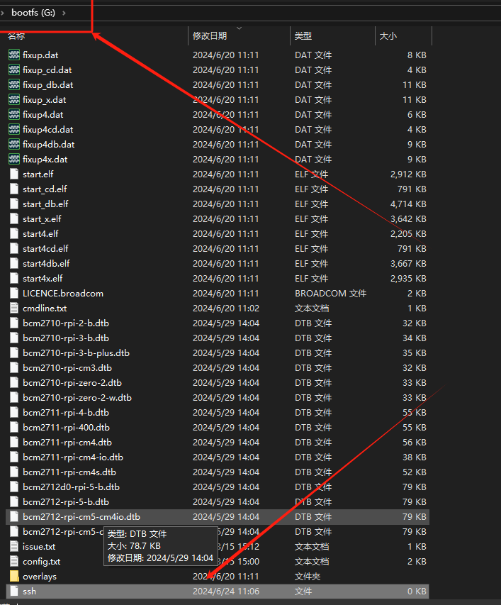
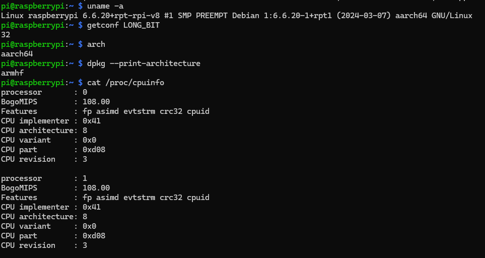
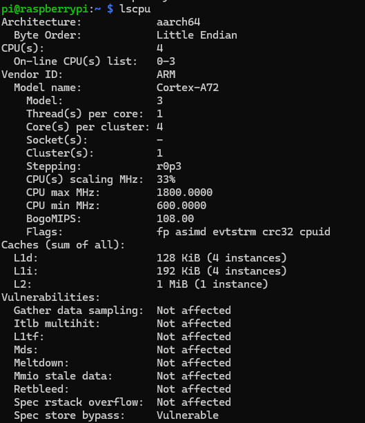
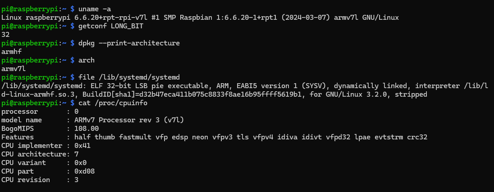
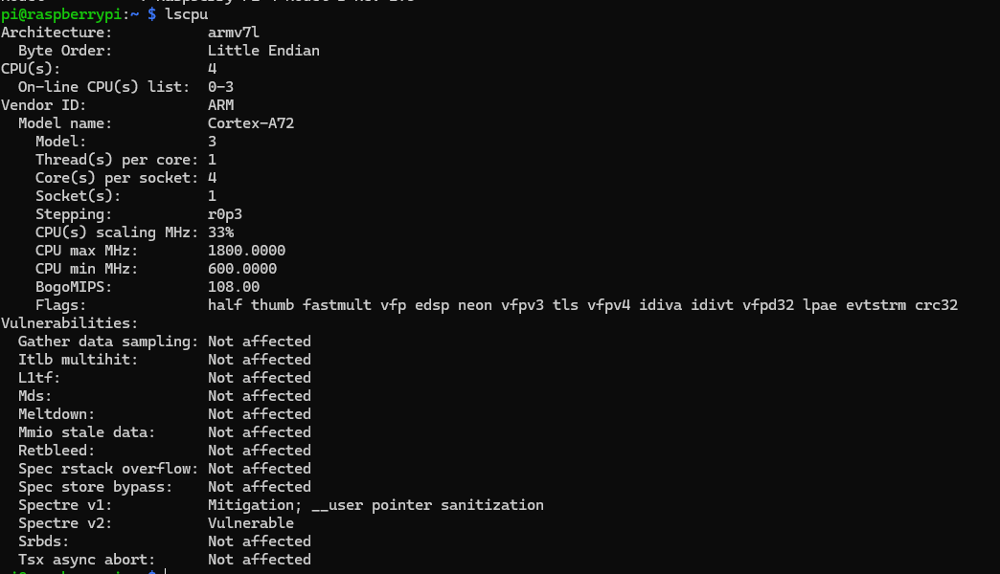

# 树莓派4B启动32位系统

## 安装系统
树莓派官网可以直接下载[系统](https://www.raspberrypi.com/software/operating-systems/#raspberry-pi-os-32-bit)，也可以用官网给的[一键安装软件](https://downloads.raspberrypi.org/imager/imager_latest.exe)安装，这两种方式都需要选择镜像版本，其中withdesktop是带桌面的版本，lite是纯命令行的版本，写32bit的是32位版本，其他的是64位版本。用win32diskmanager直接写入内存卡后，如果有显示器和键盘，可以直接插入树莓派即可启动，如果不想用显示器和键盘，想通过ssh连接方式使用，则不要着急将内存卡插入树莓派。

## 无头模式启动
不连接任何外设，只通过网线连接电脑控制树莓派的方式，叫做无头模式，使用这种模式需要对树莓派进行一些配置
### 开启ssh服务
树莓派中ssh服务是默认关闭的，因此我们需要手动开启，手动开启的方式为，在bootfs目录下新建一个文件，文件名为ssh（不带任何后缀）


### 设置默认用户名和密码
注意现在的树莓派系统出于安全考虑，已不再预设用户名和密码（2022年之前的版本有默认用户名pi和默认密码raspberry），所以安装好系统后，第一次启动有两种方法：
1. 连接显示器和键盘，根据系统引导自己设定用户名和密码
2. 新建一个文件userconf，然后设置密码

显然在此处我们选择第二种方式，具体操作步骤为：

1. 在bootfs目录下，新建一个文件，文件名为userconf，不带任何后缀名
2. 打开文件，填入文件内容，文件内容就一行，格式为：**用户名:加密后的密码**，假设要使用祖传账号密码：**pi:raspberry**，则内容为：
```
pi:$6$zzRu/pqLm1DA1RkF$jivj4Eij82S1cFimYFlBEbPXxKZbRHI6sGhwd3MlwzOhxthk1uaifNIkpIR75MP/5Wf4yBhjt6DGZU9AzbSM31
```
如果需要自己设置密码，加密后的密码获取方式为使用如下命令：
```
echo 'password' | openssl passwd -6 -stdin
```
其中password替换为你想要使用的密码

### 连接树莓派

#### 网络设置
如果此时你想使用有线网络连接电脑和树莓派，可以略过本节。

如果想使用无线网络连接的话，还需要再添加一个配置文件wpa_supplicant.conf，内容是：
```
ctrl_interface=DIR=/var/run/wpa_supplicant GROUP=netdev
update_config=1
country=CN
network={
ssid="你的SSID"
psk="你的密码"
key_mgmt=WPA-PSK
}
```
**注意：**一定要保证等号两边没有空格，否则可能连接不上。

完成设置后，就可以将SD卡插入树莓派然后启动了。（如果需要在启动32位系统，不要着急，[还得再配置一步](#修改启动参数)）

#### 探测IP并连接树莓派

这个步骤是比较常规的操作，网上资料比较多，且步骤比较繁琐，就直接贴几个好用的参考吧：

[有线连接](https://www.waveshare.net/study/article-741-1.html)

[无线连接](https://www.waveshare.net/study/portal.php?mod=view&aid=743)

如果用ssh连接过相同的ip地址，会出现ssh认证失败的提示，此时使用命令移除之前的密钥，重新接受新的密钥即可。
```
ssh-keygen -R <hostname>
```

## 修改启动参数
这一步是为了启动一个真正的32位系统，更真实的模拟软件运行的环境。
树莓派4B使用的是Arm Cortex-72内核，其基于armv8架构，如果直接用默认的配置启动系统，其会默认启动一个64位的内核，然后运行一个32位的地址空间（指令集还是64位的），不能很好的模拟一个真正的32位环境，因此需要做一些修改，来让其启动一个真正的32位内核。
方法为打开bootfs目录下的config.txt，在文件末尾加入下面两句
```
arm_64bit=0
kernel=kernel7l.img
```
即可以启动真正的32位内核。

这两句设置的具体含义可以参考[树莓派官方文档](https://pidoc.cn/docs/computers/config-txt)

**一些分析**：

如果不添加上面两句设置，直接启动官方的32位树莓派系统，查看cpu架构和系统内核，可以得到以下结果



1. 使用uname命令查看内核版本，发现架构为aarch64，即armv8的64位执行模式
2. 使用getconf LONG_BIT查看操作系统位数，为32位
3. 查看包管理器的运行架构，得到armhf，带有硬件浮点的armv7（32位）指令集
4. 查看cpu版本，发现架构为v8（64位）

如果添加了命令，则得到以下结果：




1. 使用uname命令查看内核版本，发现架构为armv7l，即armv7（32位）的小端序指令集
2. 使用getconf LONG_BIT查看操作系统位数，为32位
3. 查看系统配置文件，发现其运行的为32位ELF文件
4. 查看cpu版本，发现架构为armv7l（32位）

总结：如果不加启动选项，树莓派会启动一个在armv8（64位）指令集下运行的内核，但运行32位地址空间，所有的软件都在32位模式下运行，即64位硬件运行32位软件，如果添加启动选项，树莓派会启动一个在armv7l指令集下运行的内核，其软件硬件的运行模式都为32位。因此，添加启动选项后，树莓派的运行模式才是真正的32位模式，也可以更真实的模拟开发所用的运行环境。

## 一些参考资料
[树莓派的启动流程](http://icing.fun/2023/12/09/raspberrypi_boot/)

[树莓派文档](https://www.raspberrypi.com/documentation/computers/raspberry-pi.html#raspberry-pi-4-boot-flow)

[树莓派中文文档](https://pidoc.cn/docs/computers/getting-started)

[arm几个指令集的区别](https://www.163.com/dy/article/F8BVU5JM0531AFNT.html)

[arm指令集的区别（另外一篇）](https://www.cnblogs.com/kin-zhang/p/15031633.html)

[树莓派资源大全](https://github.com/1021683053/awesome-raspberry-pi-zh)
# 编译树莓派系统内核
参考[官方文档](https://www.raspberrypi.com/documentation/computers/linux_kernel.html#cross-compile-the-kernel)拉通一遍流程即可